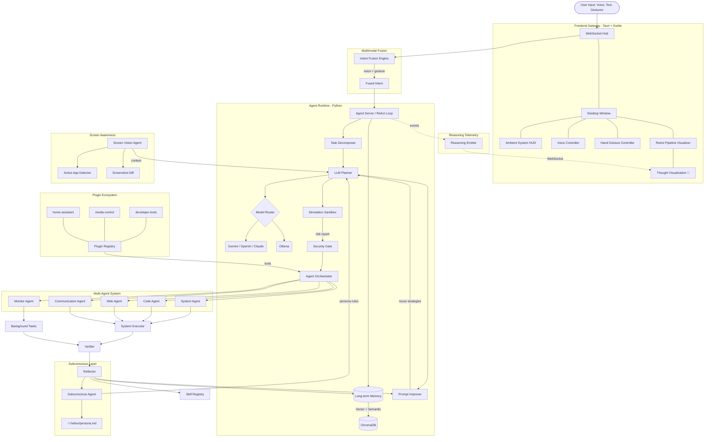

# Heliox OS — AI System Control Agent

<p align="center">
  <a href="https://gssoc.girlscript.org/"></a>
  <a href="https://github.com/VyomKulshrestha/Heliox-OS/releases"></a>
  <a href="https://github.com/VyomKulshrestha/Heliox-OS/releases"></a>
  <a href="https://github.com/VyomKulshrestha/Heliox-OS/actions/workflows/release.yml"></a>
  <a href="https://github.com/VyomKulshrestha/Heliox-OS/actions/workflows/ci.yml"></a>
  <a href="https://github.com/VyomKulshrestha/Heliox-OS/issues?q=is%3Aissue+is%3Aopen+label%3A%22good+first+issue%22"></a>
  <a href="LICENSE"></a>
  
</p>

<p align="center">
  <!-- Replace with your actual demo GIF path once recorded -->
  
</p>


<p align="center">
  <strong>Control your entire computer with natural language, voice, and hand gestures.</strong><br>
  An open-source, privacy-first AI agent that plans, executes, and verifies complex multi-step tasks.
</p>

<p align="center">
  🌐 <b><a href="https://helioxos.dev">Visit the Official Website (helioxos.dev)</a></b> 🌐
</p>

<p align="center">
  <a href="#quick-start">Quick Start</a> •
  <a href="#-jarvis-mode-new">JARVIS Mode</a> •
  <a href="#features">Features</a> •
  <a href="#architecture">Architecture</a> •
  <a href="#security">Security</a> •
  <a href="#️-troubleshooting">Troubleshooting</a> •
  <a href="CONTRIBUTING.md">Contributing</a>
</p>

---

## Why Heliox OS?

Unlike simple command runners, Heliox OS is a **true agentic system** inspired by robust autonomous architectures like OpenClaw, running a continuous ReAct loop with a **modular multi-agent orchestrator**:

1. **Gateway Hub & Memory** — LLM evaluates persistent memory context before reasoning.
2. **Planner** — Converts natural language into a structured multi-step action plan.
3. **Agent Orchestrator** — Routes each action to the correct specialist agent (System, Code, Web, Monitor, Communication).
4. **Specialist Agents** — Five domain experts execute actions via native OS APIs (never flimsy GUI automation).
5. **Verifier** — Post-execution verification confirms the action succeeded and feeds results back into the loop.
6. **Reflector** — Self-improvement engine learns from successes and failures.
7. **Security** — Five-tier permission system with confirmation gates and rollback support.

## 🤖 JARVIS Autonomy (v0.7.1)

Heliox OS has achieved true proactive autonomy, transitioning from a reactive assistant to an invisible, always-on background intelligence system natively integrated into your OS:

- 🧠 **Proactive Suggestion Engine**: Learns your daily workflows and pattern-matches your screen context to silently surface UI action suggestions (e.g., offering to summarize a long thread or launch an IDE when browsing issues) *before* you ask.
- ⚡ **Fire-and-Forget Autonomous Jobs**: Spawn complex multi-step background tasks that decompose, execute, and verify completely independent of the UI or main event loop.
- 👁️ **Always-On Screen Awareness**: Automatically bootstrapped computer vision that tracks your contextual state cross-platform, natively bridging exactly what you see into the LLM planner. 
- 🎤 **Continuous Voice Listener**: Real-time push-free 'Hey Heliox' ambient wake-word dispatch for frictionless task execution.
- 🤚 **30+ Hand Gestures & Air Drawing**: Control your PC via webcam with static poses (Palm, Pinch) and motion gestures (Two-Finger Swipe).
- 🌀 **Arc Reactor UI & Ambient HUD**: Animated, immersive Tauri overlays responding contextually to system actions.

## 🧠 TRIBE v2 Cognitive Engine Integrations (v0.7.1)

Heliox OS is now fully neuro-adaptive, integrating Meta's **TRIBE v2 Cognitive Engine** directly into the operating logic:

1. **Neural Cognitive HUD:** Tracks real-time *Saliency* and *Brain Load* via screen vision buffer, mapped onto the Svelte UI.
2. **Dynamic TTS Stress-Pacing:** JARVIS automatically slows down voice generation if you are engaged in high cognitive-load tasks.
3. **Neuro-Safe Destructive Gate:** High-risk actions (e.g., recursive deletes) evaluate cognitive stress first. If you are distracted, a strict 10-second auditory confirmation gate holds the process.
4. **Subconscious Persona Fingerprint:** The Subconscious background loop learns your neural visual plasticity constraints and encodes them to `persona.md` to align UIs to your brain.
5. **Attention-Optimized Notifications:** The notification pipeline dynamically buffers trivial background alerts until the system detects a "cortical transition" (a low-load resting state).
6. **ReAct Neural Cost Estimator:** Tasks predict aggregate cognitive demand proactively logic. If executing a plan risks exceeding mental bandwidth, JARVIS pauses.
7. **JARVIS Intent Classifier:** Fully integrated native intent fusion classifying spoken commands against current workload intensity.

## 🚀 Revolutionary TRIBE v2 Cognitive Features (v0.6.0)

Heliox OS now pushes the boundaries with **7 revolutionary biologically-inspired AI features** powered by Meta's **TRIBE v2** neural model:

### 1. Adaptive Biometric Learning Loop
Track user's physiological patterns over weeks (time-of-day productivity, stress cycles). Create personalized "cognitive fingerprints" that predict optimal interaction times. Implements a closed-loop feedback system where user responses refine the TRIBE predictions.

```python
from pilot.cognitive.biometric_loop import BiometricLearningLoop

loop = BiometricLearningLoop(user_id="user")
loop.record_cognitive_sample(attention=0.7, stress=0.3, load=0.5)
recommendation = loop.get_interaction_recommendation()
print(recommendation.recommended, recommendation.interaction_type)
```

### 2. Ambient Intelligence Mode
Instead of reactive commands, Heliox proactively suggests actions based on predicted cognitive state. Example: *"You've been on this task for 2 hours with increasing stress — want me to schedule a break?"*

```python
from pilot.cognitive.ambient_intelligence import AmbientIntelligenceEngine

ambient = AmbientIntelligenceEngine(biometric_loop)
await ambient.update_cognitive_state(attention=0.8, stress=0.6, load=0.7)
# Automatically generates proactive suggestions based on trends
```

### 3. Multi-Modal Neural Bridge
Extend beyond screen vision — integrate webcam eye-tracking, audio tone analysis, keyboard/mouse dynamics. Build a unified "neural workspace" that predicts what the user will need before they ask.

```python
from pilot.cognitive.neural_bridge import NeuralBridge

bridge = NeuralBridge()
bridge.record_keystroke()
bridge.record_mouse_move(x, y)
workspace = bridge.compute_workspace()
print(workspace.cognitive_state, workspace.predicted_need)
```

### 4. Cognitive Offloading
When load > 80%, automatically surface "memory anchors" — key info from recent actions. Let Heliox absorb cognitive burden by remembering complex multi-step workflows.

```python
from pilot.cognitive.cognitive_offload import CognitiveOffloader

offloader = CognitiveOffloader()
offloader.update_load(0.85)  # Triggers offload surface
surface = offloader.get_offload_surface()
print(surface["anchors"], surface["workflows"])
```

### 5. Evolving Persona Architecture
Move from static persona.md to a living "neural avatar" that changes daily based on cognitive patterns. The AI's communication style adapts: concise when stressed, detailed when relaxed.

```python
from pilot.cognitive.evolving_persona import EvolvingPersonaEngine

persona = EvolvingPersonaEngine(user_id="user")
persona.record_interaction(attention=0.7, stress=0.3, load=0.5)
greeting = persona.get_greeting()  # "Good afternoon! Ready to tackle anything?"
print(persona.get_ui_config())  # Adapts UI based on state
```

### 6. Cross-Device Cognitive Handoff
If TRIBE detects high load on desktop, suggest continuing on mobile with context transfer. Build a "cognitive state cloud" that follows the user across devices.

```python
from pilot.cognitive.cognitive_handoff import CognitiveHandoffEngine

handoff = CognitiveHandoffEngine(device_name="desktop")
handoff.capture_snapshot(attention=0.8, stress=0.6, load=0.7)
handoff.sync_to_cloud()
suggestion = handoff.get_handoff_suggestion(load=0.85, stress=0.3)
```

### 7. Quantum-Ready Architecture
Design the cognitive pipeline to be model-agnostic — swap TRIBE for future neural models. Create standard cognitive APIs that other developers can build on.

```python
from pilot.cognitive.quantum_cognitive import create_pipeline, QuantumCognitivePipeline

pipeline = create_pipeline()
output = await pipeline.predict("user working on complex task")
print(output.attention_score, output.stress_level, output.cognitive_load)

# Switch models at runtime
pipeline.set_active_model("gpt_neuro")  # Future model support
```

### Unified Cognitive Hub

All features are wrapped in a single interface:

```python
from pilot.cognitive.hub import CognitiveHub

hub = CognitiveHub()
state = await hub.analyze("user is coding")

# All features accessible
print(f"Attention: {state.attention}, Stress: {state.stress}")
print(f"Optimal: {state.optimal_interaction}")
print(f"Overloaded: {state.is_overloaded}")
print(hub.get_greeting())  # Adaptive greeting
print(hub.get_offload_surface())  # Memory anchors
```

### TRIBE-Powered

The **QuantumCognitivePipeline** automatically uses TRIBE v2 when available:

```
Available Models:
  - Meta TRIBE v2 (tribe_v2)
    Available: True
    Capabilities: ATTENTION_PREDICTION, STRESS_DETECTION, LOAD_ESTIMATION
    Avg Latency: ~50ms
```

When TRIBE is unavailable, it gracefully falls back to heuristic models.

---

## 🧠 Multi-Agent Orchestrator

Heliox OS uses a **modular multi-agent architecture** where specialized agents collaborate to solve complex tasks:

| Agent | Domain | Key Skills |
|-------|--------|------------|
| 🖥️ **System Agent** | OS Operations | Files, processes, services, power, input control, screen vision, triggers |
| 💻 **Code Agent** | Development | Code generation, execution, debugging, dev tooling (git, pip, npm) |
| 🌐 **Web Agent** | Web & APIs | Browser automation, scraping, HTTP requests, downloads |
| 📊 **Monitor Agent** | Monitoring | CPU, RAM, disk, network monitoring with threshold alerts |
| 📡 **Communication Agent** | Messaging | Email, Slack, Discord, webhooks, desktop notifications |

**How it works:** The Planner generates an action plan → the Orchestrator analyzes each action type → routes to the correct specialist → agents execute in sequence → results merge for verification.

**Dynamic Spawning:** Agents can be created on-demand at runtime via the `agent_spawn` API endpoint.

## 🧪 Tested With 10 Complex Tasks — 80%+ Pass Rate

| Task | Type | Status |
|------|------|--------|
| Web scrape Wikipedia + word frequency analysis | Web + Code | ✅ |
| Background CPU trigger with voice alert | System Monitor | ✅ |
| Screenshot OCR + text reversal + file tree | Vision + Code | ✅ |
| Multi-page web comparison (Python vs JS) | Web + Analysis | ✅ |
| Create project scaffold + run unit tests | File + Code | ✅ |
| REST API fetch + JSON parse + formatted table | API + Code | ✅ |
| CSV data pipeline + financial analysis | Data + Code | ✅ |
| And more... | | ✅ |

## 🖥️ Cross-Platform Support

| Platform | Status |
|----------|--------|
| Windows 10/11 | ✅ Full support |
| Ubuntu / Debian | ✅ Full support |
| macOS | ✅ Full support |
| Fedora / Arch | ✅ Via dnf/pacman |

## ⚡ 50+ Action Types

### File Operations
`file_read` · `file_write` · `file_delete` · `file_move` · `file_copy` · `file_list` · `file_search` · `directory_summary` · `file_permissions`

### Process Management
`process_list` · `process_kill` · `process_info`

### Shell Execution
`shell_command` · `shell_script` (multi-line bash/powershell/python)

### Code Execution
`code_execute` — Run Python, PowerShell, Bash, or JavaScript with auto-fix on failure

### Browser & Web
`browser_navigate` · `browser_extract` · `browser_extract_table` · `browser_extract_links`

### Screen & Vision
`screenshot` · `screen_ocr` · `screen_analyze`

### Package Management
`package_install` · `package_remove` · `package_update` · `package_search`
Auto-detects: winget, choco, brew, apt, dnf, pacman

### System Information
`system_info` · `cpu_usage` · `memory_usage` · `disk_usage` · `network_info` · `battery_info`

### Window Management
`window_list` · `window_focus` · `window_close` · `window_minimize` · `window_maximize`

### Audio / Volume
`volume_get` · `volume_set` · `volume_mute`

### Display / Screen
`brightness_get` · `brightness_set` · `screenshot`

### Power Management
`power_shutdown` · `power_restart` · `power_sleep` · `power_lock` · `power_logout`

### Network / WiFi
`wifi_list` · `wifi_connect` · `wifi_disconnect`

### Clipboard
`clipboard_read` · `clipboard_write`

### Scheduled Tasks & Triggers
`schedule_create` · `schedule_list` · `schedule_delete` · `trigger_create`

### Environment Variables
`env_get` · `env_set` · `env_list`

### Downloads
`download_file`

### Service Management (Linux)
`service_start` · `service_stop` · `service_restart` · `service_enable` · `service_disable` · `service_status`

### GNOME / Desktop (Linux)
`gnome_setting_read` · `gnome_setting_write` · `dbus_call`

### Windows Registry
`registry_read` · `registry_write`

### Open / Launch / Notify
`open_url` · `open_application` · `notify`

## Architecture



## 🧠 Research-Level AI Architecture

Heliox OS implements **13 research-level features** that push beyond typical AI agents:

| # | Feature | Status | Module |
|---|---------|--------|--------|
| 1 | Persistent Long-Term Memory (Vector + Semantic) | ✅ | `memory/store.py` + ChromaDB |
| 2 | Self-Reflection Loop | ✅ | `agents/reflector.py` |
| 3 | Tool Discovery / Skill Registry | ✅ | `agents/reflector.py` (skill_registry table) |
| 4 | Task Decomposition Engine | ✅ | `agents/decomposer.py` |
| 5 | Autonomous Background Agents | ✅ | `agents/background.py` + `monitor_agent.py` |
| 6 | Multi-Agent Collaboration | ✅ | `agents/orchestrator.py` (5 specialists) |
| 7 | Real-Time Reasoning Visualization | ✅ | `reasoning/events.py` + `ReActPipeline.svelte` |
| 8 | Simulation Sandbox | ✅ | `agents/sandbox.py` |
| 9 | Self-Improving Prompt System | ✅ | `agents/prompt_improver.py` |
| 10 | Plugin Ecosystem | ✅ | `plugins/__init__.py` |
| 11 | Flagship Plugins (Developer, Media, IoT) | ✅ | `plugins/developer/`, `plugins/media/`, `plugins/homeassistant/` |
| 12 | Subconscious Agent (Persona Learning) | ✅ | `agents/subconscious.py` |
| 13 | Screen Vision (Continuous Screen Awareness) | ✅ | `agents/screen_vision.py` |

### 🔧 Task Decomposition Engine

Complex goals are automatically broken into dependency-aware subtask trees:

```
User: "Build a Flask API for todo list"
 → 1. [system] Create project folder
 → 2. [system] Install Flask            (depends: 1)
 → 3. [code]   Generate API code         (depends: 1)
 → 4. [code]   Create requirements.txt   (depends: 2)
 → 5. [code]   Run tests                 (depends: 3, 4)
```

### 🛡️ Simulation Sandbox

Before executing dangerous commands, the sandbox produces an **impact report**:

```
⚠️ Simulation Report:
  Risk: HIGH
  Impact: 154 files affected (wildcard)
  Warnings:
    - ⚠️ Plan contains destructive actions
    - 🔐 Plan requires elevated privileges
    - ♻️ 2 action(s) are NOT reversible
  Recommendation: ⚠️ HIGH RISK — Confirm impact
```

### 🧬 Self-Improving Prompt System

Successful reasoning chains are stored and reused:
- Keyword-indexed prompt templates with success/failure rates
- Automatic strategy matching for similar future tasks
- Rolling improvement — the agent gets better over time

### 🔌 Plugin Ecosystem

Heliox OS ships with **3 flagship plugins** and supports community-built extensions:

| Plugin | Type | Capabilities |
|--------|------|--------------|
| **developer-tools** | Code | Jira tickets, `git clone`, branch, commit, push, GitHub PRs |
| **media-control** | System | Spotify (play/pause/skip), system volume, YouTube, media keys |
| **home-assistant** | IoT | Smart lights, switches, thermostats, scenes, device discovery |

Drop custom plugins into `~/.heliox/plugins/` — they're auto-discovered at startup
after Ed25519 signature verification. Production registries can verify against
bundled trusted public keys; local plugin packages can include
`plugin.ed25519.pub` with `plugin.ed25519.sig`. Unsigned, untrusted, or tampered
plugins are rejected before their manifest or code is loaded.

```json
{
  "name": "my-plugin",
  "version": "1.0.0",
  "tools": [{"name": "my_tool", "inputs": ["arg1"], "action_type": "api_call"}]
}
```

### 🧠 Subconscious Agent (Persona Learning)

A background agent that runs every 30 minutes to review the day's actions and learn user preferences:

- Clusters behavioral patterns ("always writes Python", "prefers dark mode")
- Extracts actionable rules with confidence scores
- Writes a `~/.heliox/persona.md` that is injected into planner context
- Supports manual preference setting via `persona_add_preference` API
- Categories: `preference`, `habit`, `constraint`, `style`

### 👁️ Screen Vision Agent

Continuous computer-vision loop that gives the agent awareness of what the user sees:

- Takes screenshots every 2 seconds, hashes for change detection
- Detects the active application and window title cross-platform
- Maintains a rolling context buffer of recent screen states
- When user says "summarize this" or "close that", the planner already knows the target
- Optional LLM-powered screen description for advanced awareness

## 🚀 Installation

### Option 1: Download Compiled Desktop App (Recommended)

The easiest way to get started is to download the pre-compiled installer for your operating system.

1. Go to the [GitHub Releases page](https://github.com/VyomKulshrestha/Heliox-OS/releases).
2. Download the installer for your OS:
   - **Windows**: `Heliox OS_x64-setup.exe`
   - **macOS (Apple Silicon)**: `Heliox OS_aarch64.dmg`
   - **macOS (Intel)**: `Heliox OS_x86_64.dmg`
   - **Linux**: `.AppImage` or `.deb`
3. Install the app.
4. Open Heliox OS and enter your API Key (e.g., Gemini, OpenAI, Claude) in the Settings tab.

*Note: The Python backend requires Python 3.11+ installed on your system. You must start the 
local daemon manually for now.*
## Windows Troubleshooting

### Missing DLL Errors

**Error Messages:**
**Root Cause:** PyTorch requires CUDA runtime DLLs in system PATH

**Fix:**

1. Install Visual C++ Redistributable:
   - Download: https://support.microsoft.com/en-us/help/2977003
   - Install the **x64** version

2. Reinstall PyTorch matching your CUDA version:
```bash
# For CUDA 12.1 (most common)
pip install torch torchvision torchaudio --index-url https://download.pytorch.org/whl/cu121

# For CUDA 11.8
pip install torch torchvision torchaudio --index-url https://download.pytorch.org/whl/cu118

# For CPU only
pip install torch torchvision torchaudio
```

3. Verify installation:
```bash
python -c "import torch; print(torch.cuda.is_available())"
```

---

### CUDA Version Mismatch

**Error Messages:**
CUDA runtime version mismatch
CUDA version is insufficient for this model
RuntimeError: CUDA out of memory

**Root Cause:** PyTorch CUDA version doesn't match installed NVIDIA CUDA version

**Fix:**

1. Check your CUDA version:
```bash
nvidia-smi
```

2. Check PyTorch CUDA version:
```bash
python -c "import torch; print(torch.version.cuda)"
```

3. Match your CUDA version using this table:

| NVIDIA CUDA | Installation Command |
|---|---|
| 12.4+ | `pip install torch --index-url https://download.pytorch.org/whl/cu124` |
| 12.1 | `pip install torch --index-url https://download.pytorch.org/whl/cu121` |
| 11.8 | `pip install torch --index-url https://download.pytorch.org/whl/cu118` |
| CPU Only | `pip install torch` |

4. Reinstall PyTorch:
```bash
pip uninstall torch torchvision torchaudio -y
pip cache purge
pip install torch --index-url https://download.pytorch.org/whl/cu121
```

---
### TRIBE v2 Engine Installation

**Requirements:**
- Python 3.11+
- CUDA 11.8 or 12.1
- PyTorch installed first
- Visual C++ 2019 or newer

**Error Messages:**
TRIBE v2 requires CUDA version 11.8 or higher
ImportError: cannot import name 'TribeModel' from 'tribev2'

**Installation Steps:**

1. Install PyTorch first:
```bash
pip install torch --index-url https://download.pytorch.org/whl/cu121
```

2. Clone and install tribev2 from facebookresearch:
```bash
git clone https://github.com/facebookresearch/tribev2.git
cd tribev2
pip install -e .
```

3. Verify installation:
```bash
python -c "from tribev2 import TribeModel; print('TRIBE v2 loaded successfully')"
```

4. Load a pretrained model:
```python
from tribev2 import TribeModel

model = TribeModel.from_pretrained("facebook/tribev2", cache_folder="./cache")
```


---

### PATH Environment Variable Issues

**Error Messages:**
CUDA is not available
Cannot find nvcc compiler

**Fix:**

1. Open Environment Variables:
   - Press `Win + X` → Click "System"
   - Click "Advanced system settings"
   - Click "Environment Variables" button

2. Add CUDA to PATH:
   - Find **Path** variable and click Edit
   - Add these two paths:
     - `C:\Program Files\NVIDIA GPU Computing Toolkit\CUDA\v12.1\bin`
     - `C:\Program Files\NVIDIA GPU Computing Toolkit\CUDA\v12.1\libnvvp`
   - (Replace v12.1 with your CUDA version)

3. Restart terminal and verify:
```bash
nvcc --version
```

---

### GPU Out of Memory Errors

**Error Message:**
RuntimeError: CUDA out of memory. Tried to allocate X.XX GiB

**Solutions:**

1. Reduce batch size in your code:
```python
batch_size = 32  # Instead of 64 or 128
```

2. Clear GPU memory:
```bash
python -c "import torch; torch.cuda.empty_cache()"
```

3. Check GPU memory:
```bash
python -c "import torch; print(torch.cuda.get_device_properties(0))"
```

4. Use CPU if needed:
```python
device = "cpu"  # Instead of "cuda"
```

---

### Visual C++ Build Tools Missing

**Error Message:**
error: Microsoft Visual C++ 14.0+ is required

**Fix:**

1. Download Visual Studio Build Tools:
   - Go to: https://visualstudio.microsoft.com/downloads/
   - Click "Build Tools for Visual Studio 2022"

2. Run the installer and select:
   - ✓ Desktop development with C++
   - ✓ Windows 11 SDK

3. Complete installation and **restart your computer**

---

### Quick Diagnostic

Check your setup with this command:
```bash
python -c "import torch; print('PyTorch:', torch.__version__); print('CUDA Available:', torch.cuda.is_available()); print('CUDA Version:', torch.version.cuda if torch.cuda.is_available() else 'N/A')"
```

**Still having issues?**

Try a clean reinstall:
```bash
pip cache purge
pip install --upgrade pip setuptools wheel
pip install torch --index-url https://download.pytorch.org/whl/cu121
```

For more information, see [PyTorch Installation Guide](https://pytorch.org/get-started/locally/)


### Option 2: Build from Source (For Developers)

> Note: Windows contributors can use the automated `setup.ps1` script for environment setup.  
> If PowerShell blocks the script, check the Windows setup instructions in [CONTRIBUTING.md](CONTRIBUTING.md).

If you want to contribute or modify Heliox OS, build it from the source code:

**1. Install the Python daemon:**
```bash
git clone https://github.com/VyomKulshrestha/Heliox-OS.git
cd Heliox OS/daemon
pip install -e ".[full,dev]"
```

**2. Choose your LLM:**
*   Local (Ollama): `ollama pull llama3.1:8b` -> `ollama serve`
*   Cloud (Gemini/OpenAI/Claude): Add your API key in the app GUI.

**3. Run the daemon:**
```bash
cd daemon
python -m pilot.server
```

**4. Run the frontend:**
```bash
cd tauri-app/ui
npm install
npm run dev
```

## Example Commands

```
"Show me my system info"
"Take a screenshot and read the text on screen"
"Go to Wikipedia's page on AI and summarize the first 3 paragraphs"
"Create a Python project with tests and run them"
"Kill the process using the most CPU"
"Monitor my CPU and alert me when it goes above 80%"
"Download a file and show me a tree of the folder"
"List all .py files on my Desktop"
"Set my volume to 50%"
"Create a CSV with sales data and analyze it"
"What's my IP address?"
"Install Firefox"
```

## 🛡️ Security

> [!WARNING]
> **PLEASE READ BEFORE USE: SYSTEM COMPROMISE RISK**
> Heliox OS is an autonomous agent with the ability to execute code, delete files, and run terminal commands directly on your host operating system. While we have provided sandbox measures, the AI has real system access. **Do NOT run Heliox OS with root/Administrator privileges** unless absolutely necessary. We are not responsible for accidental data loss caused by LLM hallucinations.

- All AI outputs pass through structured schema validation before execution
- Five-tier permission system (read-only through root-level)
- Confirmation required for system-modifying and destructive actions
- Snapshot-based rollback via Btrfs or Timeshift (Linux)
- Append-only audit log for all executed actions
- Command whitelist with optional unrestricted mode
- **Encrypted API key storage** via platform keyring (GNOME Keyring / Windows Credential Manager)
- API keys are NEVER logged, included in plans, or sent to local LLMs

### Permission Tiers

| Tier | Level | Auto-Execute | Examples |
|------|-------|-------------|----------|
| 0 - Read Only | 🟢 | Yes | file_read, system_info, clipboard_read |
| 1 - User Write | 🟡 | Yes | file_write, clipboard_write, env_set |
| 2 - System Modify | 🟠 | Needs Confirm | package_install, service_restart, wifi_connect |
| 3 - Destructive | 🔴 | Needs Confirm | file_delete, process_kill, power_shutdown |
| 4 - Root Critical | ⛔ | Needs Confirm | root operations, disk operations |

## Configuration

Config file: `~/.config/pilot/config.toml`

```toml
[model]
provider = "ollama"           # "ollama" | "cloud"
ollama_model = "llama3.1:8b"
cloud_provider = "gemini"     # "gemini" | "openai" | "claude"

[security]
root_enabled = false
confirm_tier2 = true
unrestricted_shell = false
snapshot_on_destructive = true

[server]
host = "127.0.0.1"
port = 8785

[proxy]
http = "http://proxy.example.com:8080"
https = "http://proxy.example.com:8080"
no_proxy = "localhost,127.0.0.1"
```
## 🛠️ Troubleshooting

### Frequently Asked Questions (FAQ)

#### Q1: The daemon fails to start — what should I check?
**A:** First, verify you are using **Python 3.11+**. Check your version with `python --version`. If it still fails, check the logs at `~/.local/state/heliox-os/pilot.log` for specific error messages. Ensure that port `8785` is not being used by another application.

#### Q2: I get an API key error even though I entered one.
**A:** Heliox OS stores API keys securely in your system keyring (GNOME Keyring/libsecret on Linux, Credential Manager on Windows) or an encrypted `vault.enc` file. It does **not** use `.env` files. Ensure you've added the key via the Settings tab in the UI. If the issue persists, check if `libsecret-1-dev` is installed (on Linux).

#### Q3: How do I switch from Ollama to a cloud LLM?
**A:** You can change your model provider in the `~/.config/heliox-os/config.toml` file. Under the `[model]` section, set `provider = "cloud"` and specify your `cloud_provider` (e.g., `"gemini"`, `"openai"`, or `"claude"`).

```toml
[model]
provider = "cloud"
cloud_provider = "gemini"
```

#### Q4: Voice detection isn't working on Linux.
**A:** Ensure that `portaudio19-dev` and `python3-pyaudio` are installed on your system. You may also need to grant your terminal or the Heliox app permission to access the microphone in your system settings.

#### Q5: Hand gesture control requires a webcam — which ones are supported?
**A:** Any standard USB or integrated webcam supported by your OS will work. Heliox OS uses OpenCV for vision tasks. If your camera isn't detected, ensure no other application is currently using it. Note that there is no `CAMERA_INDEX` configuration variable; the system automatically attempts to find the default camera.

#### Q6: Port already in use (8785 or 8786).
**A:** Heliox OS uses port `8785` for the API and `8786` for mesh networking. If these ports are occupied, you can identify and stop the conflicting process:

**Linux/macOS:**
```bash
lsof -i :8785
kill -9 <PID>
```

**Windows:**
```powershell
netstat -ano | findstr :8785
taskkill /PID <PID> /F
```

#### Q7: Frontend Not Starting.
**A:** If the UI fails to launch, try clearing the npm cache and reinstalling dependencies:

```bash
cd tauri-app/ui
npm install
npm run dev
```

Ensure all frontend dependencies are installed successfully before starting the app.

#### Q8: PyTorch or TRIBE v2 installation issues on Windows (Missing DLLs / CUDA).
**A:** Many Windows users encounter missing DLLs or CUDA version mismatches when installing the cognitive engine. Follow these steps:

1.  **Missing DLLs (`msvcp140.dll`, `vcruntime140_1.dll`):** Install the [Microsoft Visual C++ Redistributable](https://aka.ms/vs/17/release/vc_redist.x64.exe). This is required for PyTorch's C++ extensions.
2.  **CUDA Mismatch:** Ensure your PyTorch installation matches your system's CUDA version. Run `nvidia-smi` to check your driver's CUDA version, then reinstall PyTorch if necessary:
    ```bash
    # Example: For CUDA 12.1
    pip install torch --index-url https://download.pytorch.org/whl/cu121
    # For CPU-only (no GPU)
    pip install torch --index-url https://download.pytorch.org/whl/cpu
    ```
3.  **OSError [WinError 126]:** This usually indicates a missing dependency for `torch` or `torchaudio`. Ensure you are using **Python 3.11+ (64-bit)** and try reinstalling the daemon dependencies:
    ```bash
    cd daemon
    pip install -e ".[full]"
    ```

## 🤝 Contributing

We love contributions! Whether it's adding a new gesture, fixing a bug, or building a new plugin, check out our guides to get started.

1. Read our [Contributing Guide](CONTRIBUTING.md) to set up your dev environment.
2. Check the [Good First Issues](https://github.com/VyomKulshrestha/Heliox-OS/issues?q=is%3Aissue+is%3Aopen+label%3A%22good+first+issue%22) tab to find beginner-friendly tasks.
3. Review our [Code of Conduct](CODE_OF_CONDUCT.md).
4. Join the community discussions in [GitHub Discussions](https://github.com/VyomKulshrestha/Heliox-OS/discussions).

## License

MIT
